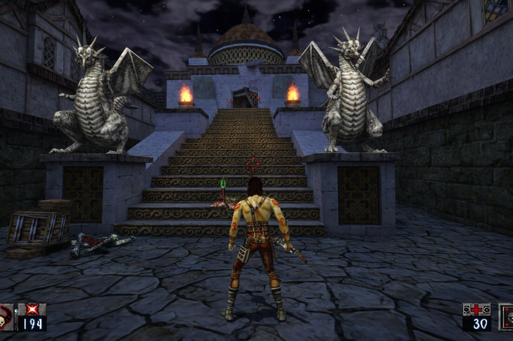

# Heretic II Remastered


A Very Special Thank You to the efforts of the developers of Heretic2R (Source Port) Without this none of this would be possible! https://github.com/m-x-d/Heretic2R
Heretic II Remastered is a reverse-engineered source port of Heretic II (1998, Raven Software), with HD enhancements and modern engine improvements. Now completely 64bit with modern game control support out of the box and automatic detection of Original game data (Steam / GOG / CD) The best way to play Heretic II now and for the forseeable future!




[VIDEO (YOUTUBE)](https://www.youtube.com/watch?v=xOLrOAykgWw&feature=youtu.be)

## Features

* Widescreen support (with automatic HUD scaling).
* Rendering framerate decoupled from network packets sending rate (with theoretical maximum of 1000 FPS).
* OGG music playback.
* Most of special effects are updated at rendering framerate (instead of 20 FPS).
* Improved map loading times.
* Lots of cosmetic improvements (so the game plays as you remember it, not as it actually played).
* Many bugfixes.
* Gamepad support via SDL3 (xinput/dinput/HID controllers).
* HiDPI / high-resolution display support.
* **OpenGL 3.3 Core Profile** renderer (`ref_gl3.dll`). Allows support for ReShade (all latest versions) as FPO is supported with Depth Buffer (Upside down, flip to use in global preprocessor settings)
* **With the OpenGL 3.3 renderer, the game can run on modern Linux and macOS via Wine/Proton** (untested, but should work in theory).
* **Windows Media Foundation** video playback backend (`winmf_video.dll`) for MP4/MKV support and better performance compared to libsmacker.
* **stb_vorbis** OGG music playback backend (`stbv_music.dll`) for better performance and lower memory usage compared to libvorbis.
* **Dynamic Shadow Mapping** — dynamic shadows for entities and world geometry, with support for alpha-tested textures (e.g. grates, fences).
* **Dynamic Lighting** — dynamic per-pixel lighting for entities and world geometry, with support for normal maps and specular maps in HD textures.
* **Parallax Mapping** — parallax mapping for world geometry, with support for height maps in HD textures.
* **Bloom** — bloom post-processing effect for emissive materials (e.g. lava, fire).
* **Screen Space Reflections** — screen space reflections for water surfaces.
* **Anti-Aliasing** — FXAA anti-aliasing for smoother edges.
* **Configurable controls** — fully customizable keybindings and gamepad mappings via in-game menu.
* **Skyboxes now have dynamic stars** (instead of static sky textures).
* **Improved particle effects** — more particles, better blending, and support for HD textures.
* **Improved water rendering** — animated water surfaces with reflections and refractions.
* **SAO (Screen Space Ambient Occlusion)** — ambient occlusion effect for better depth perception and contact shadows.
* **HD texture replacement** — drop-in PNG replacements for original `.m8`/`.m32` textures via the `HDTextures` folder.
* **HD video playback** — MP4/MKV cinematics via Windows Media Foundation.
* **PAK2 archive format** — extended PAK format supporting filenames up to 128 characters (see below).
* **`base.pak` support** — all game data (textures, models, sounds, music, HD textures, HD videos) can be distributed as a single `base.pak` archive.
* **Automatic CD detection** — if a Heretic II CD is in any CD/DVD drive, the engine automatically extracts the required PAK files (no manual copying needed).

## Installation

**Game data:**  
Heretic II Remastered requires Heretic II game data in order to run.

**Automatic Installation**
Since R7 release, Heretic 2 Remastered can automatically find and copy the required PAK files from any copy installed on your PC through Steam, GOG or original CD installation.
If it finds the required data, it will copy in the background and start as soon as it's ready. No setup needed.
In the event that it cannot find your installed copy, proceed to manual installation.

**Manual Installation:**  
 
– Copy "`Htic2-0.pak` and `Htic2-1.pak`) into the `base` folder of Heretic II Remastered.
- Make sure you've downloaded the latest version of Remastered, which includes the base.pak, containing all the necessary HD textures, music OGGs, and HD videos. If you have an older version without base.pak, you can either update to the latest version or extract `base.pak` from the latest release and place it in the `base` folder.
- If you have the original game CD, the engine will **automatically detect it** and extract the required PAK files — see the **CD Auto-Detection** section below. You can also copy the files manually.
- If you don't have the original game CD, you can purchase Heretic II from GOG or Steam, which both include the necessary game data files. Just make sure to point Remastered to the correct `base` folder where those files are located.

**HD textures:**  
Place PNG replacement textures in "**base\HDTextures**", mirroring the original texture paths. The renderer will automatically use them in place of the original `.m8`/`.m32` textures.  
HD textures can also be loaded from `base.pak`.

**HD videos:**  
Place MP4 or MKV cinematics in "**base\video**". The game will play them in place of the original `.cin`/`.smk` files.  
HD videos can also be loaded from `base.pak`.

## Performance Improvements (R7 v2.0.7)

**Multithreaded Job System**  
The OpenGL 3.3 renderer now includes a multithreaded job system that automatically detects the number of available CPU cores and uses them for parallel rendering tasks.

- **Particle Rendering**: Particle vertex generation is parallelized across multiple CPU cores, resulting in **2–3x performance improvement** on 4-core systems for scenes with 128+ particles.
- **Automatic Core Detection**: The job system automatically adapts to the system's CPU configuration (supports 1–16 worker threads).
- **Fallback Mode**: For small particle counts (<128), the system uses sequential processing to avoid threading overhead, ensuring consistent performance across all scenarios.
- **Stability**: Includes improvements to the renderer's shutdown sequence to ensure clean exit and prevent game hangs.
- **Backward Compatibility**: Works on all systems and automatically degrades to single-threaded mode on single-core CPUs or when explicitly configured.

This improvement provides the best results in high-particle-count scenarios such as:
- Dense weather effects (rain, snow)
- Explosion particles
- Magical spell effects
- Atmospheric effects (dust, fog, sparks)

**Now 64bit for the first time**  
The game engine, renderer and backends are now all 64bit with 100% compatibility with the original game data. Only caveat is that save files made in 32bit and prior versions WILL NOT WORK.

## CD Auto-Detection

On startup, the engine scans all CD/DVD drives for the original Heretic II disc. If the disc is found (identified by the presence of `Setup/zip/h2.zip`), the engine automatically extracts `Htic2-0.pak` and `Htic2-1.pak` from the CD's installer ZIP archive into the `base` directory. A splash screen is displayed during extraction.

- If both PAK files already exist in the `base` folder, extraction is skipped.
- The built-in ZIP/DEFLATE decompressor requires no external libraries.

## Controller Guide

Heretic II Remastered has full gamepad support via SDL3. Any XInput, DirectInput, or HID controller should work out of the box. Analog sticks provide smooth movement and camera control — the left stick moves, the right stick looks (swappable via `joy_layout 1` for southpaw).

### Button Mapping

> Names follow Xbox layout. PlayStation equivalents in parentheses.

#### Face Buttons

| Button | Action |
|---|---|
| **A** (Cross) | Jump / Swim up |
| **B** (Circle) | Quick 180° turn *(also Back in menus)* |
| **X** (Square) | Interact / Use |
| **Y** (Triangle) | Crouch / Swim down |

#### Triggers & Bumpers

| Button | Action |
|---|---|
| **RT** (R2) | Attack |
| **LT** (L2) | Defend / Block |
| **RB** (R1) | Next weapon |
| **LB** (L1) | Previous weapon |

#### Stick Clicks

| Button | Action |
|---|---|
| **L3** | Run / Sprint |
| **R3** | Creep / Sneak |

#### D-Pad

| Direction | Action |
|---|---|
| Up | Next defense |
| Down | Previous defense |
| Left | Previous weapon |
| Right | Next weapon |

#### System

| Button | Action |
|---|---|
| **Start** (Options) | Open / Close menu |
| **Back** (Select) | Open inventory |

### Analog Sticks

| Stick | Default (`joy_layout 0`) | Southpaw (`joy_layout 1`) |
|---|---|---|
| Left Stick | Movement | Camera look |
| Right Stick | Camera look | Movement |

The right stick (or left in southpaw) controls yaw and pitch with an adjustable response curve for fine-grained aiming at low deflections.

### Controller Cvars

All controller settings are saved automatically and can be tuned in the console:

| Cvar | Default | Description |
|---|---|---|
| `joy_enable` | `1` | Enable / disable gamepad input |
| `joy_deadzone` | `0.2` | Stick deadzone (0.0 – 1.0) |
| `joy_sensitivity_yaw` | `240` | Horizontal look speed (°/sec at full deflection) |
| `joy_sensitivity_pitch` | `150` | Vertical look speed (°/sec at full deflection) |
| `joy_sensitivity_move` | `1.0` | Movement stick multiplier |
| `joy_trigger_threshold` | `0.12` | Trigger activation threshold |
| `joy_invert_y` | `0` | Invert camera Y axis |
| `joy_response_curve` | `1.5` | Look stick response curve exponent (1.0 = linear, higher = more precision at low deflections) |
| `joy_layout` | `0` | Stick layout: 0 = default, 1 = southpaw |

### Rebinding

All buttons can be rebound via the console. The key names are:

```
Face:     Joy1 (A)  Joy2 (B)  Joy3 (X)  Joy4 (Y)
Bumpers:  Aux6 (LB) Aux7 (RB)
Triggers: Aux12 (LT) Aux13 (RT)
Sticks:   Aux4 (L3) Aux5 (R3)
D-pad:    Aux8 (Up) Aux9 (Down) Aux10 (Left) Aux11 (Right)
System:   Aux1 (Back) Aux3 (Start)
```

Example: `bind Joy1 "+attack"` to put attack on the A button.

## base.pak and the PAK2 format

All Remastered game data — including HD textures, music OGGs, and HD videos — can be packed into a single `base.pak` archive using the included **MakePak** tool. When present in the `base` directory, `base.pak` is automatically loaded by the engine alongside the original `Htic2-0.pak` / `Htic2-1.pak` files.

The original Quake/Heretic II PAK format limits filenames to 56 characters, which is too short for many HD texture paths. To solve this, a new **PAK2** format is used:

| Feature | PAK (original) | PAK2 (extended) |
|---|---|---|
| Header ident | `PACK` | `PAK2` |
| Filename length | 56 characters | 128 characters |
| Directory entry struct | `dpackfile_t` | `dpackfile2_t` |

The engine auto-detects both formats when loading any `.pak` file, so original `Htic2-*.pak` files continue to work unchanged.

### MakePak tool

The `MakePak` tool packs a directory tree into a PAK2 archive:

```
MakePak.exe <inputdir> [outputfile]
```

- `inputdir` — path to the directory to pack (e.g. the `base` game data folder).
- `outputfile` — output `.pak` filename (defaults to `base.pak` in the current directory).

The following file types are excluded from packing: `.cfg`, `.dll`, `.pak`.

### How PAK loading works

The engine loads content from `base.pak`, `Htic2-0.pak` through `Htic2-9.pak`, and loose files. The subsystems that previously used direct filesystem I/O have been updated to go through the engine's `FS_LoadFile` / `FS_FOpenFile` functions first, falling back to direct file access for backward compatibility:

- **HD textures** — the GL3 renderer tries `FS_LoadFile` (which searches PAK files and loose directories) before falling back to direct `fopen`.
- **Music (OGG)** — the sound backend tries `FS_LoadFile` with `stb_vorbis_open_memory`, falling back to `stb_vorbis_open_filename` for loose files.
- **HD videos (MP4/MKV)** — the client tries loose files first, then extracts from PAK to a temporary file for Windows Media Foundation playback (which requires a file path).

## Technical notes

* Savegames/configs/screenshots/logs are stored in "**%USERPROFILE%\Saved Games\Heretic2R**".
* This version of the game does not include Multiplayer, and is not a planned feature.
* Savegames are **NOT** compatible with original H2 savegames nor prior 32bit builds.
* Framerates above 60 FPS are supported.

## Planned features

* See issues.

## Used libraries

* [glad](https://glad.dav1d.de)
* [libsmacker](https://github.com/JonnyH/libsmacker)
* [SDL3](https://www.libsdl.org)
* [stb](https://github.com/nothings/stb) (specifically, stb_image, stb_image_write, and stb_vorbis)

## SAST Tools

[PVS-Studio](https://pvs-studio.com/pvs-studio/?utm_source=website&utm_medium=github&utm_campaign=open_source) - static analyzer for C, C++, C#, and Java code.
