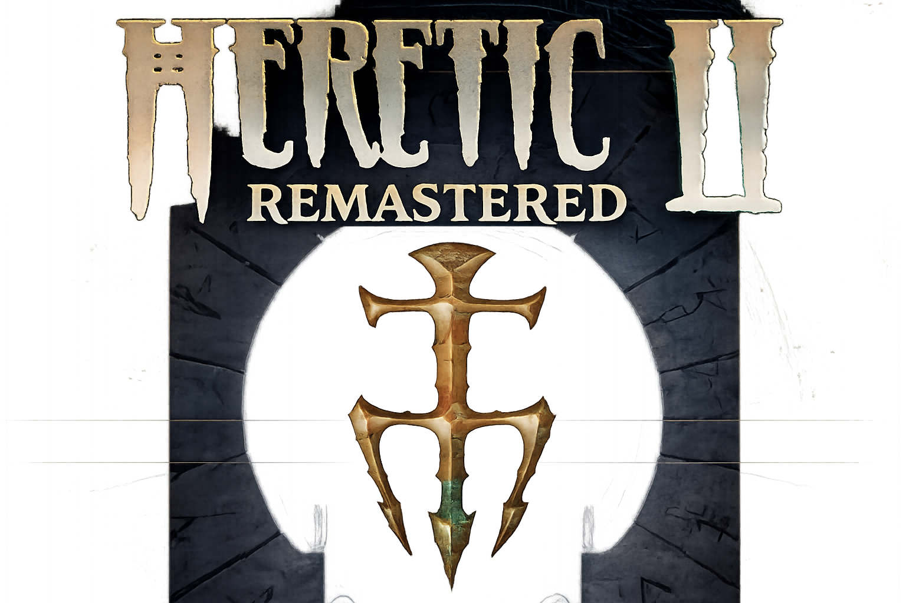
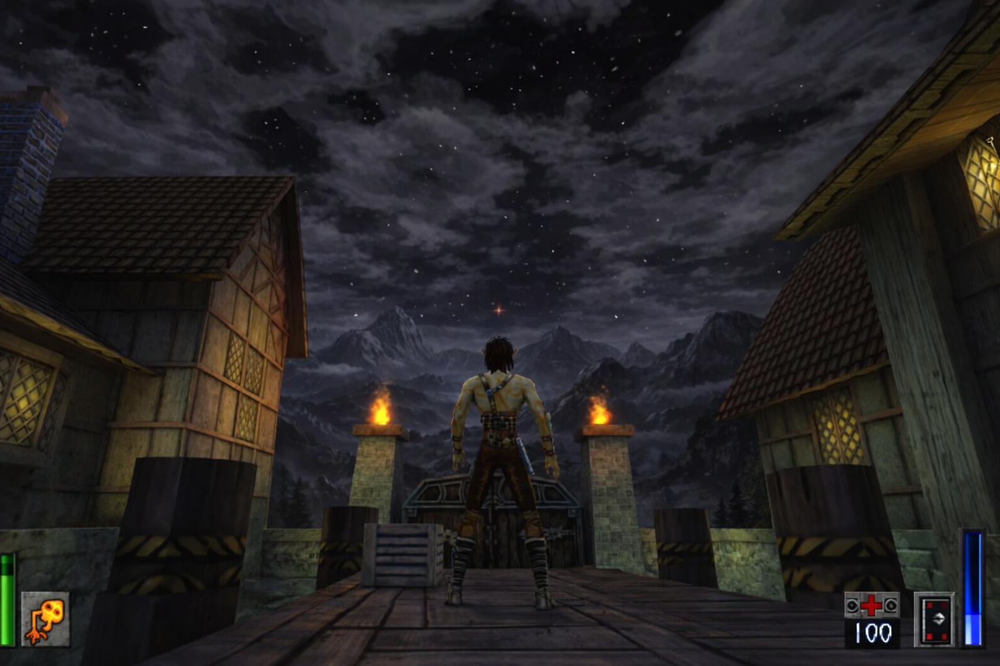

# Heretic II Remastered



Heretic II Remastered is a reverse-engineered source port of Heretic II (1998, Raven Software), with HD enhancements and modern engine improvements.



## Features

* Widescreen support (with automatic HUD scaling).
* Rendering framerate decoupled from network packets sending rate (with theoretical maximum of 1000 FPS).
* OGG music playback.
* Most of special effects are updated at rendering framerate (instead of 20 FPS).
* Improved map loading times.
* Lots of cosmetic improvements (so the game plays as you remember it, not as it actually played).
* Many bugfixes.
* Gamepad support via SDL3 (xinput/dinput/HID controllers).
* HiDPI / high-resolution display support.
* **OpenGL 3.3 Core Profile** renderer (`ref_gl3.dll`).
* **With the OpenGL 3.3 renderer, the game can run on modern Linux and macOS via Wine/Proton** (untested, but should work in theory).
* **Windows Media Foundation** video playback backend (`winmf_video.dll`) for MP4/MKV support and better performance compared to libsmacker.
* **stb_vorbis** OGG music playback backend (`stbv_music.dll`) for better performance and lower memory usage compared to libvorbis.
* **Dynamic Shadow Mapping** — dynamic shadows for entities and world geometry, with support for alpha-tested textures (e.g. grates, fences).
* **Dynamic Lighting** — dynamic per-pixel lighting for entities and world geometry, with support for normal maps and specular maps in HD textures.
* **Parallax Mapping** — parallax mapping for world geometry, with support for height maps in HD textures.
* **Bloom** — bloom post-processing effect for emissive materials (e.g. lava, fire).
* **Screen Space Reflections** — screen space reflections for water surfaces.
* **Anti-Aliasing** — FXAA anti-aliasing for smoother edges.
* **Configurable controls** — fully customizable keybindings and gamepad mappings via in-game menu.
* **Skyboxes now have dynamic stars** (instead of static sky textures).
* **Improved particle effects** — more particles, better blending, and support for HD textures.
* **Improved water rendering** — animated water surfaces with reflections and refractions.
* **SAO (Screen Space Ambient Occlusion)** — ambient occlusion effect for better depth perception and contact shadows.
* **HD texture replacement** — drop-in PNG replacements for original `.m8`/`.m32` textures via the `HDTextures` folder.
* **HD video playback** — MP4/MKV cinematics via Windows Media Foundation.
* **PAK2 archive format** — extended PAK format supporting filenames up to 128 characters (see below).
* **`base.pak` support** — all game data (textures, models, sounds, music, HD textures, HD videos) can be distributed as a single `base.pak` archive.

## Installation

**Game data:**  
Heretic II Remastered requires Heretic II game data in order to run.
 
– Copy "`Htic2-0.pak` and `Htic2-1.pak`) into the `base` folder of Heretic II Remastered.
- Make sure you've downloaded the latest version of Remastered, which includes the base.pak, containing all the necessary HD textures, music OGGs, and HD videos. If you have an older version without base.pak, you can either update to the latest version or extract `base.pak` from the latest release and place it in the `base` folder.
- If you have the original game CD, you can also copy the required files from there, but make sure to update to v1.06 as described below, otherwise the game will not work correctly because of missing models/textures/sounds.
- If you don't have the original game CD, you can purchase Heretic II from GOG or Steam, which both include the necessary game data files. Just make sure to point Remastered to the correct `base` folder where those files are located.
- 

---
**NOTICE**: make sure your copy of Heretic II is updated to v1.06, otherwise the game will not work correctly because of missing models/textures/sounds.
- If you are not sure, the presence of "**base\models\items\Defense\tornado\tris.fm**" and "**base\models\items\Defense\tornado\!skin.pcx.m8**" files is a good indication that your copy is already updated to v1.06.
- If said files are missing, you can either install [Heretic II v1.06 official patch](https://community.pcgamingwiki.com/files/file/1736-heretic-ii-enhancement-pack/) (also known as **Heretic II Enhancement Pack**), or extract [Heretic_II_Patch_106_for_H2R.zip](https://github.com/m-x-d/Heretic2R/tree/main/stuff) archive into Heretic II folder.
---

**HD textures:**  
Place PNG replacement textures in "**base\HDTextures**", mirroring the original texture paths. The renderer will automatically use them in place of the original `.m8`/`.m32` textures.  
HD textures can also be loaded from `base.pak`.

**HD videos:**  
Place MP4 or MKV cinematics in "**base\video**". The game will play them in place of the original `.cin`/`.smk` files.  
HD videos can also be loaded from `base.pak`.

## base.pak and the PAK2 format

All Remastered game data — including HD textures, music OGGs, and HD videos — can be packed into a single `base.pak` archive using the included **MakePak** tool. When present in the `base` directory, `base.pak` is automatically loaded by the engine alongside the original `Htic2-0.pak` / `Htic2-1.pak` files.

The original Quake/Heretic II PAK format limits filenames to 56 characters, which is too short for many HD texture paths. To solve this, a new **PAK2** format is used:

| Feature | PAK (original) | PAK2 (extended) |
|---|---|---|
| Header ident | `PACK` | `PAK2` |
| Filename length | 56 characters | 128 characters |
| Directory entry struct | `dpackfile_t` | `dpackfile2_t` |

The engine auto-detects both formats when loading any `.pak` file, so original `Htic2-*.pak` files continue to work unchanged.

### MakePak tool

The `MakePak` tool packs a directory tree into a PAK2 archive:

```
MakePak.exe <inputdir> [outputfile]
```

- `inputdir` — path to the directory to pack (e.g. the `base` game data folder).
- `outputfile` — output `.pak` filename (defaults to `base.pak` in the current directory).

The following file types are excluded from packing: `.cfg`, `.dll`, `.pak`.

### How PAK loading works

The engine loads content from `base.pak`, `Htic2-0.pak` through `Htic2-9.pak`, and loose files. The subsystems that previously used direct filesystem I/O have been updated to go through the engine's `FS_LoadFile` / `FS_FOpenFile` functions first, falling back to direct file access for backward compatibility:

- **HD textures** — the GL3 renderer tries `FS_LoadFile` (which searches PAK files and loose directories) before falling back to direct `fopen`.
- **Music (OGG)** — the sound backend tries `FS_LoadFile` with `stb_vorbis_open_memory`, falling back to `stb_vorbis_open_filename` for loose files.
- **HD videos (MP4/MKV)** — the client tries loose files first, then extracts from PAK to a temporary file for Windows Media Foundation playback (which requires a file path).

## Technical notes

* Savegames/configs/screenshots/logs are stored in "**%USERPROFILE%\Saved Games\Heretic2R**".
* Singleplayer works. The game is completable without any issues.
* This version of the game does not include Multiplayer, and is not a planned feature.
* By default, network protocol 55 is used (H2 protocol 51 is also supported, but not recommended). Can be changed using the "protocol" cvar.
* Savegames are **NOT** compatible with original H2 savegames.
* **NOT** compatible with original H2 renderers (because of API changes).
* **NOT** compatible with original H2 sound backends (because of API changes).
* **NOT** compatible with original H2 gamex86/Player/Client Effects libraries (because of API changes).
* Framerates above 60 FPS are supported.

## Planned features

* None Currently, the project is complete.

## Used libraries

* [glad](https://glad.dav1d.de)
* [libsmacker](https://github.com/JonnyH/libsmacker)
* [SDL3](https://www.libsdl.org)
* [stb](https://github.com/nothings/stb) (specifically, stb_image, stb_image_write, and stb_vorbis)

## SAST Tools

[PVS-Studio](https://pvs-studio.com/pvs-studio/?utm_source=website&utm_medium=github&utm_campaign=open_source) - static analyzer for C, C++, C#, and Java code.
